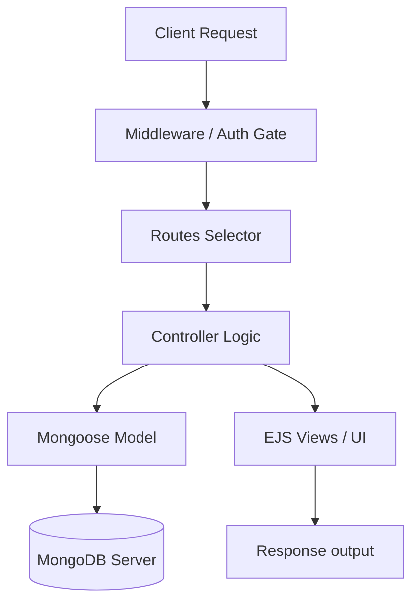

# 🚀 Node.js & Express Learning Workspace

Welcome to the Node.js and Express learning and project workspace! This repository contains a collection of backend development projects, starting from basic Express servers up to complete MVC-based Web applications with MongoDB database integration, user authentication, and role-based routing.

---

## 📂 Project Showcase

The workspace is organized into three distinct projects:

| Project | Description | Key Tech Stack | Port |
| :--- | :--- | :--- | :--- |
| **1. Root (Hello World)** | Minimalistic entry point introducing routing, middleware, and request/response cycles. | Express.js, Node.js | `8000` |
| **2. Project-01 (User API)** | Clean RESTful API built on the **MVC Architecture** with database integration and request logging. | Express, MongoDB/Mongoose, Nodemon | `8000` |
| **3. Project-2 (URL Shortener)** | Fully featured short URL app featuring dynamic redirection, EJS views, JWT Auth, and Admin/User roles. | EJS, JWT, Cookies, Mongoose, Nanoid | `8001` |

---

## 🛠️ Prerequisites & Installation

Before running any of the application projects, ensure you have the following installed on your machine:

1. **Node.js** (v18.x or higher recommended) -> [Download Node.js](https://nodejs.org/)
2. **MongoDB** (Local Community Server running on your default port `27017`) -> [Download MongoDB](https://www.mongodb.com/try/download/community)
3. **Compass / Postman** (For database inspection and API testing)

---

## 🏗️ Getting Started & Run Instructions

Choose the project you want to build/setup and follow the steps below:

### 1. Root Project (Hello World Express Server)
A lightweight playground server serving simple static and dynamic endpoints.

```bash
# Navigate to the root directory (if not already there)
cd Hello-World

# Install base dependencies
npm install

# Start the server
npm start
```
* Access the App:
  - Homepage: `http://localhost:8000/`
  - About page: `http://localhost:8000/about?name=YourName`

---

### 2. Project-01: User Management REST API (MVC)
An industry-standard REST API managing a collection of user accounts. Implements logging for every incoming request and uses database modeling.

```bash
# Navigate to the Project-01 directory
cd Project-01

# Install requirements
npm install

# Start development server with Nodemon
npm start
```
* **Database Target**: Connects to `mongodb://127.0.0.1:27017/YoutubeApp`
* **Core API Endpoints**:
  - `GET /api/users` - Retrieve all users (JSON format)
  - `GET /api/users/:id` - Retrieve user details by ID
  - `POST /api/users` - Add a new user
  - `PATCH /api/users/:id` - Edit user information
  - `DELETE /api/users/:id` - Remove a user

---

### 3. Url-Shortner: Advanced URL Shortener with Auth
A secure URL shortener utilizing JWT cookies, authorization tiers (`ADMIN` and `NORMAL`), and dynamic templating using HTML/CSS/EJS.

```bash
# Navigate to the Url-Shortner directory
cd Url-Shortner

# Install package dependencies
npm install

# Spin up the app with warnings tracing enabled
npm start
```
* **Database Target**: Connects to `mongodb://localhost:27017/short-url`
* **Core Features**:
  - `GET /` - Public signup/login portal & Dashboard
  - `POST /url` - Shorten a target destination link (Generates a clean ID using `nanoid`)
  - `GET /url/:shortId` - Core redirect agent logic tracking visits
  - `POST /user` - Register and authenticate user (JWT session token stored in cookie)

---

## 🎨 Architectural Overview (MVC System)

Both `Project-01` and `Url-Shortner` are structured following the **Model-View-Controller** design pattern to maintain clean separation of concerns:



- 📂 **Models**: Define data schemas to represent database objects structure mapping.
- 📂 **Controllers**: Contain the core business rules and handlers triggered by web requests.
- 📂 **Routes**: Coordinate paths mapping URIs directly to appropriate controllers.
- 📂 **Middlewares**: Process requests (logging headers, cookie decoding, role-based authorization check) prior to standard handler execution.
- 📂 **Views**: (In Url-Shortener) Dynamic UI frames utilizing EJS template compilation.

---

## 📝 Practice Exercises Notes
> [!TIP]
> Use **Postman** to test REST API mutations (`POST`, `PATCH`, `DELETE`) as modern web browsers default to standard `GET` requests unless custom client script logic is used.
> Access logs are automatically formatted and appended into a `log.txt` file within active workspace directories. Keep an eye on it to inspect traffic!
